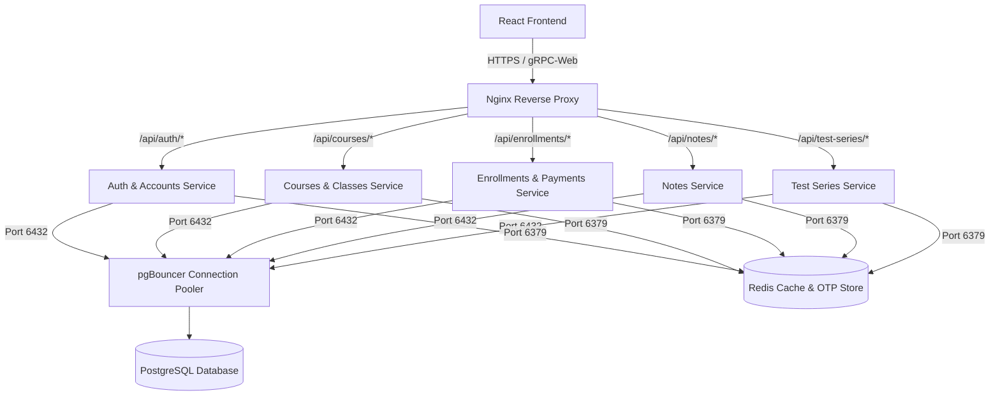

# Golang Microservice Migration Blueprint

This document provides a comprehensive, step-by-step technical blueprint to migrate the **ClaSynq Django Monolith** (source folder: `D:\clasynq_02\Backend`) to a high-performance **Golang Microservice Architecture** (to be created in folder: `D:\Clasynq_future_update\API_2.0`) without modifying the existing PostgreSQL schema, altering the React frontend, or changing environment credentials.

---

## 1. Target Architecture Overview

The monolithic Django backend is split into **5 logical microservices** sharing the same PostgreSQL database instance (via pgBouncer) and the same Redis instance.



---

## 2. Microservice Domain Boundaries

| Service Name | Handled Database Tables | Core Responsibilities | Port |
| :--- | :--- | :--- | :--- |
| **Auth & Accounts Service** | `users`, `students`, `admin`, `teachers`, `user_follows`, `user_notifications`, `pending_registrations`, `password_reset_otps` | Token generation (HS256), registration/login validation, OTPs, Profile CRUD, followers, notifications. | `8081` |
| **Courses & Classes Service** | `courses`, `subjects`, `class_schedules`, `courses_teachers`, `courses_subjects` | Course catalog, live lecture scheduling, classroom link management, instructor assignments. | `8082` |
| **Enrollments & Payments Service**| `enrollments`, `payment_orders`, `referral_transactions` | Razorpay integrations, webhook processing, student coins ledger, automatic referral rewards. | `8083` |
| **Notes Service** | `notes`, `note_accesses` | Offloading PDF note files to Cloudinary, managing note purchases, public/class notes categorization. | `8084` |
| **Test Series Service** | `test_series`, `tests`, `questions`, `question_options`, `student_test_attempts`, `student_answers`, `test_results`, `test_series_accesses` | CBT exam engine, multi-format grading (MCQ, MSQ, NAT), real-time leaderboards, timer checks. | `8085` |

---

## 3. Recommended Go Project Structure

Every microservice should follow **Clean Architecture (Domain-Driven Design)** principles to isolate business logic from database frameworks (Gorm/sqlx) and HTTP routers (Gin/Fiber).

```text
/clasynq-microservice
  ├── /cmd
  │     └── /server
  │           └── main.go         # App entrypoint, loads env variables, spins up router
  ├── /config
  │     └── config.go             # Environment variable parser (viper / cleanenv)
  ├── /internal
  │     ├── /domain               # Entities, database schema interfaces, business models
  │     │     └── user.go
  │     ├── /repository           # Database queries (GORM / sqlx)
  │     │     └── postgres_user.go
  │     ├── /usecase              # Business rules / Orchestrators
  │     │     └── auth_usecase.go
  │     └── /delivery             # HTTP / gRPC Transport Layer (Gin routers, request controllers)
  │           └── /http
  │                 ├── handler.go
  │                 └── middleware.go
  ├── go.mod
  └── go.sum
```

---

## 4. Database Layer Compatibility & Mapping

We will use Go structs with **GORM tags** to match the existing PostgreSQL tables and column names exactly. 

### A. User Entity (`users` table)
```go
package domain

import (
	"time"
)

type User struct {
	ID                 int64      `gorm:"primaryKey;column:id"`
	FullName           string     `gorm:"column:full_name;type:varchar(255);not null"`
	Username           string     `gorm:"column:username;type:varchar(30);unique;not null"`
	ContactNumber      string     `gorm:"column:contact_number;type:varchar(32);unique;not null"`
	Email              string     `gorm:"column:email;type:varchar(255);unique;not null"`
	Password           string     `gorm:"column:password;type:varchar(128);not null"`
	AvatarURL          string     `gorm:"column:avatar_url;type:text"`
	Headline           string     `gorm:"column:headline;type:varchar(255);default:'Learning Path Enthusiast | ClaSynqian'"`
	Bio                string     `gorm:"column:bio;type:text"`
	Skills             string     `gorm:"column:skills;type:text"`
	Website            string     `gorm:"column:website;type:varchar(500)"`
	Github             string     `gorm:"column:github;type:varchar(500)"`
	Linkedin           string     `gorm:"column:linkedin;type:varchar(500)"`
	Twitter            string     `gorm:"column:twitter;type:varchar(500)"`
	EmailAlerts        bool       `gorm:"column:email_alerts;type:boolean;default:true"`
	DirectMessages     bool       `gorm:"column:direct_messages;type:boolean;default:true"`
	FeedUpdates        bool       `gorm:"column:feed_updates;type:boolean;default:false"`
	SecurityAlerts     bool       `gorm:"column:security_alerts;type:boolean;default:true"`
	ReferralCode       string     `gorm:"column:referral_code;type:varchar(50);unique"`
	CoinsBalance       int        `gorm:"column:coins_balance;type:integer;default:0"`
	RegistrationIP     *string    `gorm:"column:registration_ip;type:inet"`
	CreatedAt          time.Time  `gorm:"column:created_at;type:timestamp with time zone;autoCreateTime"`
}

func (User) TableName() string {
	return "users"
}
```

### B. Course Entity (`courses` table)
```go
package domain

import "time"

type Course struct {
	ID                 int64      `gorm:"primaryKey;column:id"`
	CourseName         string     `gorm:"column:course_name;type:varchar(255);not null"`
	BatchID            string     `gorm:"column:batch_id;type:varchar(50);unique;not null"`
	Category           string     `gorm:"column:category;type:varchar(100);not null"`
	Language           string     `gorm:"column:language;type:varchar(50);not null"`
	Description        string     `gorm:"column:description;type:text;not null"`
	TeacherID          *int64     `gorm:"column:teacher_id"` // FK to teachers
	OriginalPrice      float64    `gorm:"column:original_price;type:numeric(10,2);not null"`
	FinalPrice         float64    `gorm:"column:final_price;type:numeric(10,2);not null"`
	DiscountPercentage int        `gorm:"column:discount_percentage;type:integer;not null"`
	CourseStatus       string     `gorm:"column:course_status;type:varchar(50);not null"`
	StartDate          time.Time  `gorm:"column:start_date;type:date;not null"`
	EndDate            time.Time  `gorm:"column:end_date;type:date;not null"`
	AccessDuration     string     `gorm:"column:access_duration;type:varchar(100);not null"`
	BannerURL          string     `gorm:"column:banner_url;type:text"`
	MeetingLink        string     `gorm:"column:meeting_link;type:text"`
	TotalStudents      int        `gorm:"column:total_students;type:integer;default:0"`
	IsFeatured         bool       `gorm:"column:is_featured;type:boolean;default:false"`
	Visibility         string     `gorm:"column:visibility;type:varchar(50);default:'public'"`
	TeacherSubjects    string     `gorm:"column:teacher_subjects;type:jsonb"`
	CreatedAt          time.Time  `gorm:"column:created_at;type:timestamp with time zone;autoCreateTime"`
}

func (Course) TableName() string {
	return "courses"
}
```

---

## 5. Go-to-Django Password Hashing Compatibility

Django hashes passwords using PBKDF2 with a SHA-256 digest in the following format:
`pbkdf2_sha256$<iterations>$<salt>$<hash_base64>`

To log users in seamlessly, Go must parse this string and verify passwords using the same formula:

```go
package utils

import (
	"crypto/sha256"
	"crypto/subtle"
	"encoding/base64"
	"errors"
	"fmt"
	"strconv"
	"strings"

	"golang.org/x/crypto/pbkdf2"
)

// VerifyDjangoPassword validates a plaintext password against a Django-style hash
func VerifyDjangoPassword(plainPassword, djangoHash string) (bool, error) {
	parts := strings.Split(djangoHash, "$")
	if len(parts) != 4 {
		return false, errors.New("invalid django hash format")
	}

	algorithm := parts[0]
	if algorithm != "pbkdf2_sha256" {
		return false, fmt.Errorf("unsupported algorithm: %s", algorithm)
	}

	iterations, err := strconv.Atoi(parts[1])
	if err != nil {
		return false, fmt.Errorf("invalid iterations: %w", err)
	}

	salt := parts[2]
	hashBase64 := parts[3]

	// Django hashes using standard PBKDF2 with SHA-256
	dk := pbkdf2.Key([]byte(plainPassword), []byte(salt), iterations, 32, sha256.New)
	calculatedHashBase64 := base64.StdEncoding.EncodeToString(dk)

	// Constant-time compare to prevent timing attacks
	if subtle.ConstantTimeCompare([]byte(hashBase64), []byte(calculatedHashBase64)) == 1 {
		return true, nil
	}
	return false, nil
}

// EncodeDjangoPassword creates a Django-compatible pbkdf2_sha256 hash string
func EncodeDjangoPassword(plainPassword, salt string, iterations int) string {
	dk := pbkdf2.Key([]byte(plainPassword), []byte(salt), iterations, 32, sha256.New)
	hashBase64 := base64.StdEncoding.EncodeToString(dk)
	return fmt.Sprintf("pbkdf2_sha256$%d$%s$%s", iterations, salt, hashBase64)
}
```

---

## 6. Stateless JWT Token Sharing

Django's `simple_jwt` payload generally encodes:
- `user_id` (representing the primary key)
- `token_type` (e.g. `'access'`)
- `exp` (unix timestamp expiry)
- `jti` (JWT unique token identifier)

In your Go auth middleware, you must decode the incoming `Authorization: Bearer <token>` header using the exact same `SECRET_KEY` configured in your `.env`.

```go
package middleware

import (
	"errors"
	"net/http"
	"strings"

	"github.com/gin-gonic/gin"
	"github.com/golang-jwt/jwt/v5"
)

type DjangoClaims struct {
	UserID    int64  `json:"user_id"`
	TokenType string `json:"token_type"`
	jwt.RegisteredClaims
}

func AuthMiddleware(secretKey string) gin.HandlerFunc {
	return func(c *gin.Context) {
		authHeader := c.GetHeader("Authorization")
		if authHeader == "" {
			c.JSON(http.StatusUnauthorized, gin.H{"detail": "Authentication credentials were not provided."})
			c.Abort()
			return
		}

		tokenParts := strings.Split(authHeader, " ")
		if len(tokenParts) != 2 || strings.ToLower(tokenParts[0]) != "bearer" {
			c.JSON(http.StatusUnauthorized, gin.H{"detail": "Invalid token format."})
			c.Abort()
			return
		}

		tokenStr := tokenParts[1]
		claims := &DjangoClaims{}

		token, err := jwt.ParseWithClaims(tokenStr, claims, func(token *jwt.Token) (interface{}, error) {
			return []byte(secretKey), nil
		})

		if err != nil || !token.Valid {
			c.JSON(http.StatusUnauthorized, gin.H{"detail": "Given token not valid for any token type."})
			c.Abort()
			return
		}

		if claims.TokenType != "access" {
			c.JSON(http.StatusUnauthorized, gin.H{"detail": "Token is not an access token."})
			c.Abort()
			return
		}

		// Store user_id in context for subsequent handlers to use
		c.Set("userID", claims.UserID)
		c.Next()
	}
}
```

---

## 7. Casing and Payload Matching (camelCase Compatibility)

The Django API uses `djangorestframework-camel-case` which automatically maps snake_case database models to camelCase payloads (e.g., `course_name` is serialized/deserialized as `courseName`).

To ensure the frontend works without changes, we specify the exact payload structures in Go with tags mapping to camelCase:

```go
type CourseResponse struct {
	ID                 int64     `json:"id"`
	CourseName         string    `json:"courseName"`
	BatchID            string    `json:"batchId"`
	Category           string    `json:"category"`
	Language           string    `json:"language"`
	Description        string    `json:"description"`
	OriginalPrice      float64   `json:"originalPrice"`
	FinalPrice         float64   `json:"finalPrice"`
	DiscountPercentage int       `json:"discountPercentage"`
	CourseStatus       string    `json:"courseStatus"`
	StartDate          string    `json:"startDate"` // formatted as YYYY-MM-DD
	EndDate            string    `json:"endDate"`
	AccessDuration     string    `json:"accessDuration"`
	BannerURL          string    `json:"bannerUrl"`
	MeetingLink        string    `json:"meetingLink"`
	IsFeatured         bool      `json:"isFeatured"`
	Visibility         string    `json:"visibility"`
}
```

---

## 8. Redis Caching & Invalidation Logic

In Django, caching invalidation relies on signals (`apps/courses/signals.py`). In Go, we will wrap repository write methods with a decorator pattern to handle cache invalidation automatically.

### Invalidation Pattern in Go
```go
package repository

import (
	"context"
	"fmt"
	"github.com/redis/go-redis/v9"
)

type CachedCourseRepository struct {
	repo  CourseRepository
	rdb   *redis.Client
}

func NewCachedCourseRepository(repo CourseRepository, rdb *redis.Client) *CachedCourseRepository {
	return &CachedCourseRepository{repo: repo, rdb: rdb}
}

func (c *CachedCourseRepository) Create(ctx context.Context, course *domain.Course) error {
	if err := c.repo.Create(ctx, course); err != nil {
		return err
	}
	
	// Invalidate course list cache keys
	c.invalidateCacheKeys(ctx, "courses_list*")
	return nil
}

func (c *CachedCourseRepository) invalidateCacheKeys(ctx context.Context, pattern string) {
	iter := c.rdb.Scan(ctx, 0, pattern, 0).Iterator()
	for iter.Next(ctx) {
		c.rdb.Del(ctx, iter.Val())
	}
}
```

---

## 9. Background Processing (Celery Alternative)

Instead of using a heavyweight Python Celery daemon, use **Asynq** in Go, which is a Redis-backed queue manager similar to Celery/Sidekiq.

```go
// Enqueue email notification job in Go
client := asynq.NewClient(asynq.RedisClientOpt{Addr: "localhost:6379"})
defer client.Close()

task, err := tasks.NewEmailNotificationTask(userID, "Welcome to ClaSynq!")
if err == nil {
    _, err = client.Enqueue(task)
}
```

---

## 10. Step-by-Step Transition & Deployment Plan

### Step A: Set Up Go Repositories on VPS
1. Set up a sub-directory in `/home/clasynq/services/` for the Go microservices.
2. Compile Go binaries for Linux:
   ```bash
   GOOS=linux GOARCH=amd64 go build -o auth-service ./cmd/server/main.go
   ```

### Step B: Launch Services as systemd Daemons
Create unit files in `/etc/systemd/system/` for each service (e.g. `csq-auth.service`, `csq-courses.service` etc.) following the pattern below:
```ini
[Unit]
Description=Clasynq Auth Microservice
After=network.target

[Service]
User=clasynq
WorkingDirectory=/home/clasynq/services/auth
EnvironmentFile=/home/clasynq/clasynq/Backend/.env
ExecStart=/home/clasynq/services/auth/auth-service
Restart=always

[Install]
WantedBy=multi-user.target
```

### Step C: Configure Nginx Path Routing (Gradual Rollout)
Nginx is the ideal mechanism to slowly shift traffic. Edit `/etc/nginx/sites-available/clasynq`:

1. **Before Migration**: All requests proxy to Gunicorn.
2. **Phase 1 (Shadow/Canary Auth Svc)**: Route only authentication traffic to Go.
   ```nginx
   # Redirect Auth requests to Go microservice on port 8081
   location /api/auth/ {
       proxy_pass http://127.0.0.1:8081;
       proxy_set_header Host $host;
       proxy_set_header X-Real-IP $remote_addr;
   }
   
   # Keep all other traffic pointing to Gunicorn socket
   location / {
       proxy_pass http://unix:/run/gunicorn/gunicorn.sock;
   }
   ```
3. **Phase 2 (Courses & Notes Svc)**: Route courses next.
   ```nginx
   location /api/courses/ {
       proxy_pass http://127.0.0.1:8082;
   }
   ```
4. **Phase 3 (Full Migration)**: Once all services are fully stable, stop the Gunicorn and Celery daemons completely. All traffic will route to Go services.

---

## 11. Checklist for Verification & Testing

- [ ] **Database Constraints Check**: Ensure Go models match nullable columns and precision decimal fields exactly.
- [ ] **Session Compatibility**: Verify that tokens generated in Python can be decrypted by Go, and vice-versa.
- [ ] **Webhook Signature Validation**: Port the Razorpay signature verification logic (`hmac-sha256`) to Go to ensure webhook processing succeeds.
- [ ] **leaderboard Leaderboard Indexes**: Ensure query syntax in the Go Test Series service continues utilizing the high-performance PostgreSQL composite index `test_attempt_rank_idx` (`['test_id', 'status', 'score', 'submitted_at']`).
